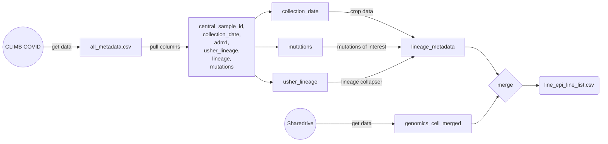

#  GPHA CLIMB SARs-CoV-2 Lineage Line List 
---

## Table of Contents

- [Info](#info)
- [Features](#features)
- [Requirements](#requirements)
- [Install](#install)
- [Usage](#usage)
- [Commands](#commands)
- [Troubleshooting](#troubleshooting)
- [Change-log](#change-log)
- [To-do](#to-do)
---

## Info

| Name         | GPHA CLIMB SARs-CoV-2 Lineage Line List                                             |
|--------------|-------------------------------------------------------------------------------------|
| Version      | 3.1                                                                                 |
| Last Updated | 04.11.2025                                                                          |
| Author(s)    | Mike Brown, Kate Howell, Ashley Shalloe                                             |
| Contact      | michael.d.brown@ukhsa.gov.uk, kate.howell@ukhsa.gov.uk, ashley.shalloe@ukhsa.gov.uk |
| Summary      | Data pipleine that produces epi-lineage linelist for COVE to produce epi-curve info for presentation at HS (to be part run on CLIMB) |

---

## Features



---

## Requirements
> [!Warning]
> To run it is neccessary to have obtained:
> Access to CLIMB <br>
> Access to Sharedrive folders: <br>
> - 01 Genomics Cell (required) <br>
> - COVE folder (optional) <br>
---

## Install
- Open terminal
- Login to CLIMB
- Run:
```bash
git clone https://github.com/ukhsa-collaboration/gpha-climb-sars-cov2-lineage-line-list.git
cd gpha-climb-sars-cov2-lineage-line-list
conda create -n covid-ll python=3.7.6
pip install .
```
> [!Tip]
> It is reccomended to run in screen or TMUX session in case of crash
---

## Usage
##### To run the pipeline
  - Navigate to gpha-climb-sars-cov2-lineage-line-list folder
  - Activate the environment
  - Run:
```bash
cd gpha-climb-sars-cov2-lineage-line-list
conda activate <env_name>
covid-ll 
(or python src/main.py)
```
##### To download to local machine
  - Open a new terminal on local machine
  - Navigate to desired parent directory
  - Run:
```bash
scp -o 'ProxyJump=<username>.<surname>@158.119.147.128' -i <path-to-CLIMB-ssh-key> -r climb-covid19-brownm2@bham.covid19.climb.ac.uk:gpha-climb-sars-cov2-lineage-line-list/<yyymmdd>-covid-ll .
```
> [!Tip]
> Default path-to-CLIMB-ssh-key: ~/SSH_Key

> [!Caution]
> Make sure to activate the correct environment to avoid errors

##### To run the notebook (notebook/lineage_line_groups_linkage.ipynb)
  - Open editor of choice
  - Open the notebook
  - Copy the latest genomics_cell_merged file (from sharefolder, colindale_data/CPHL/Bioinformatics/01 Genomics Cell/03 Outbreaks/Epicell data release/) to relevant scan folder (optional)
  - Run the notebook
  - Fill in terminal prompts
  - Send data to COVE
> [!Tip]
> Linux: when asked for user number only second value is required following running of -ls /run/user
---

## Commands
> [!Note]
> Commands have been removed for simplicity <br>
> Paths have been hardcoded <br>
> If change to path(s) required, see src modules
---

## Troubleshooting

> [!Important]
> Make sure all paths are entered correctly <br>
> Make sure to activate the correct environment to avoid errors <br>
> Linux: when asked for user number only second value is required following running of -ls /run/user <br>
---

## Change-log

---

## To-do

- [x] move related lineage grouping files into current repo
- [x] restructure repo to follow of GPHA standards
- [x] reformat auto_linelist.py and move away from stdout calls
- [ ] \(Optional) convert lineage_line_groups_linkage.ipynb notebook -> script
- [ ] \(Optional) task

---
